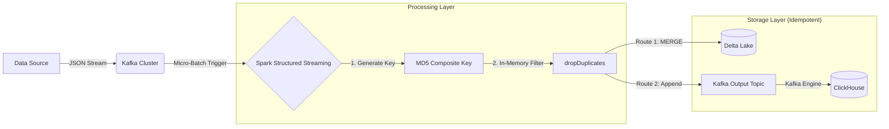

# Idempotent Real-Time Data Pipeline 

    

A fault-tolerant, high-throughput streaming pipeline designed to solve the **"Replay Problem"** in distributed systems. This project implements a **Lambda Architecture** using Spark Structured Streaming, ensuring 100% data integrity and idempotency across both transactional storage (Delta Lake) and analytical storage (ClickHouse).

-----

## 📖 Project Overview

In distributed systems, ensuring **"Exactly-Once"** processing is difficult. Network retries and system crashes often lead to data duplication ("At-Least-Once" semantics).

This pipeline solves this by implementing a **Deterministic Deduplication Strategy**. It fingerprints every event using a composite key and utilizes ACID transactions to reject duplicates at the storage level. Even if the same 1GB log file is ingested 10 times, the database state remains consistent.

### Key Features

  * **🛑 Defense-in-Depth Deduplication:**
    1.  **In-Memory:** Spark drops duplicates within the current micro-batch.
    2.  **Storage-Level:** Delta Lake performs `MERGE` (Upsert) operations to reject historical duplicates.
    3.  **Analytical:** ClickHouse uses `ReplacingMergeTree` for eventual consistency.
  * **🔑 Deterministic Identity:** Uses `MD5(User + Event + Timestamp)` to generate immutable event IDs.
  * **⚡ Handling Data Skew:** Engineered to handle massive throughput spikes (11k records/sec) followed by idle periods.

-----

## 🏗️ Architecture



### Components

| Component | Role | Configuration |
| :--- | :--- | :--- |
| **Apache Kafka** | Ingestion Buffer | 2 Brokers, 4 Partitions, RF=2 |
| **Apache Spark** | Processing Engine | Structured Streaming (15s Trigger) |
| **Delta Lake** | Batch Layer | ACID Storage, `MERGE` Logic |
| **ClickHouse** | Speed Layer | `ReplacingMergeTree` Engine |

-----

## 🚀 Getting Started

### Prerequisites

  * Docker & Docker Compose
  * Python 3.9+ (For local data generation scripts)

### Installation

1.  **Clone the repository:**

    ```bash
    git clone https://github.com/yourusername/kafka_real_time.git
    cd kafka_real_time
    ```

2.  **Start the Infrastructure:**

    ```bash
    # This builds the custom Spark image and starts Zookeeper, Kafka, and ClickHouse
    docker-compose up -d --build
    ```

3.  **Wait for Initialization:**
    The `kafka-setup` and `clickhouse-setup` containers will automatically configure topics and database schemas. Run `docker ps` to ensure all services are healthy.

-----


## 1\. Project Pipeline

Before executing the pipeline, we established the system architecture and project structure.

### **System Architecture**

The pipeline follows a Lambda Architecture, splitting data into a Speed Layer (ClickHouse) and a Batch/Storage Layer (Delta Lake) as mentioned above.


### **Project Structure**

The codebase is organized into modular scripts for ingestion (`bulk_import.py`), processing (`spark_consumer.py`), and infrastructure (`docker-compose.yml`).

```text
.
├── docker-compose.yml           # Infrastructure definition (Zookeeper, Kafka, ClickHouse, Spark)
├── Dockerfile                   # Custom Spark image with Python dependencies
├── requirements.txt             # Python libraries (kafka-python, delta-spark)
├── spark_consumer.py            # Main Spark Streaming Application (Dedup & Merge logic)
├── generate_static_data.py      # Data generator (Creates 10k unique + 1k duplicate records)
├── bulk_import.py               # High-throughput producer script (Simulates Backfill/Replay)
├── producer.py                  # Low-throughput "trickle" simulator (Simulates Live Traffic)
├── analyze_batch_performance.py # Log analysis tool (Calculates Skewness & Throughput)
└── README.md                    # Project documentation
```

-----

## 2\. Phase 1: Infrastructure & Injection

### **Kafka Topic Verification**

We verified that our topics (`raw_events` and `processed_events`) were correctly created with **4 Partitions** and **Replication Factor 2**. This partition count allows for parallel processing across our brokers.


-----

## 3\. Phase 2: Spark Processing & The "Noise Test"

We ingested an initial dataset of **11,000 records** containing **1,000 intentional duplicates**.

### **Initial Deduplication Result (Delta Lake)**

After the first batch processing, we queried the Delta Lake storage. Spark's in-memory `dropDuplicates` logic successfully removed the noise.

  * **Expected Unique Count:** 9,953
  * **Actual Result:** 9,953

.png)


### **Data Verification**

We inspected the data sample to ensure the composite keys and timestamps were parsing correctly.

.png)

### **Consistency Check**

To confirm stability, we ran the count query again. The result remained consistent at **9,953**, proving that no stray duplicates were being appended.

.png)

.png)

-----

## 4\. Phase 3: The "New Data" Test (+15 Records)

To prove the pipeline handles new data correctly while blocking replays, we injected **15 new, unique records**.

### **Spark Update Verification**

After injecting the 15 records, we queried Delta Lake again.

  * **Previous Count:** 9,953
  * **New Records:** +15
  * **Expected Total:** 9,968
  * **Actual Result:** **9,968**

.png)

This confirms that legitimate new data is inserted immediately (`whenNotMatchedInsertAll`).

-----

## 5\. Phase 4: ClickHouse Verification (Eventual Consistency)

Finally, we verified the data flow into our Speed Layer (ClickHouse).

### **Initial Sync State**

We checked the ClickHouse table `events_table`. It perfectly matched the initial Spark count.

  * **Count:** 9,953

.png)

### **The "Dirty" State (Background Merge)**

ClickHouse is optimized for write speed, so it accepts duplicates initially. Before the background merge occurred, the raw count showed extra records (duplicates + new data) pending cleanup.

  * **Raw Count:** 10,408 (Indicates duplicates exist in the table parts).

.png)

### **The Final Clean State**

By using the `FINAL` keyword (`SELECT count(*) FROM events_table FINAL`), we forced ClickHouse to apply the deduplication logic at query time.

  * **Result:** **9,968**

.png)

This proves that ClickHouse eventually reaches the same consistent state as Delta Lake.

### **Data Inspection**

A final look at the raw data in ClickHouse confirms that `dedup_key` and versions are tracking correctly.

.png)


-----
## 👥 Contributors

This project is a collaborative effort by a dedicated team of 5
- [**Nishtha**](https://github.com/novnishtha)
- [**Riya**](https://github.com/Riyag012)
- [**Pulkit**](https://github.com/pulkitjn3010)
- [**Shivansh**](https://github.com/sh1vanshgaur)
- [**Anuj**](https://github.com/animus08)
